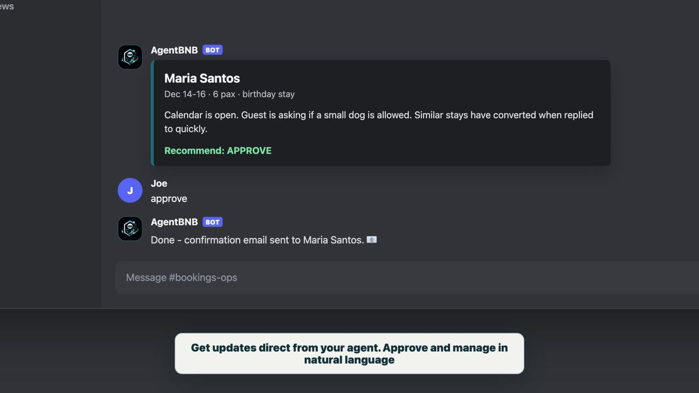
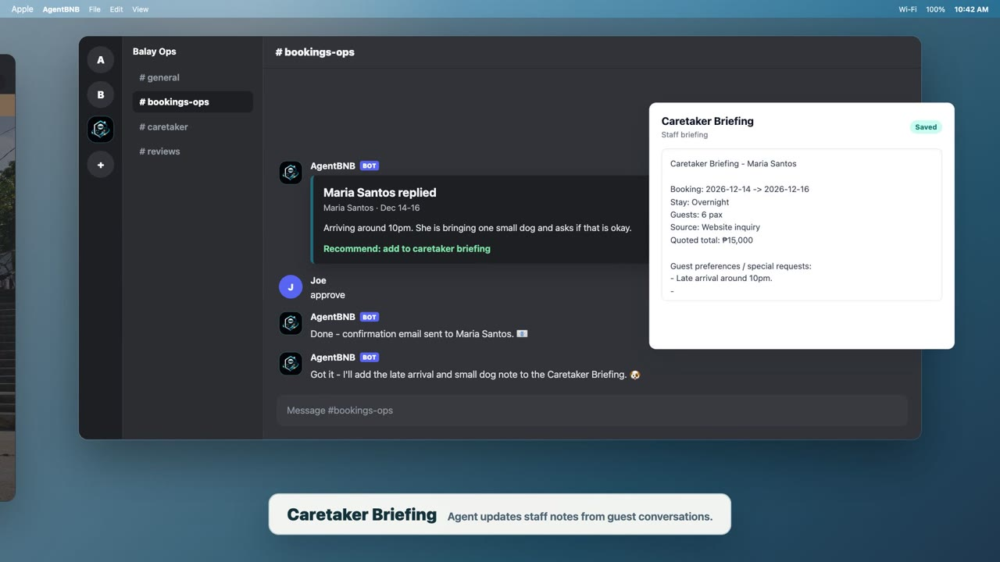
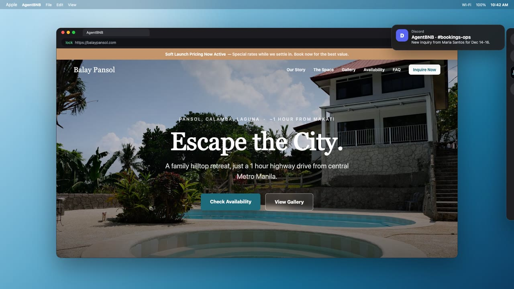
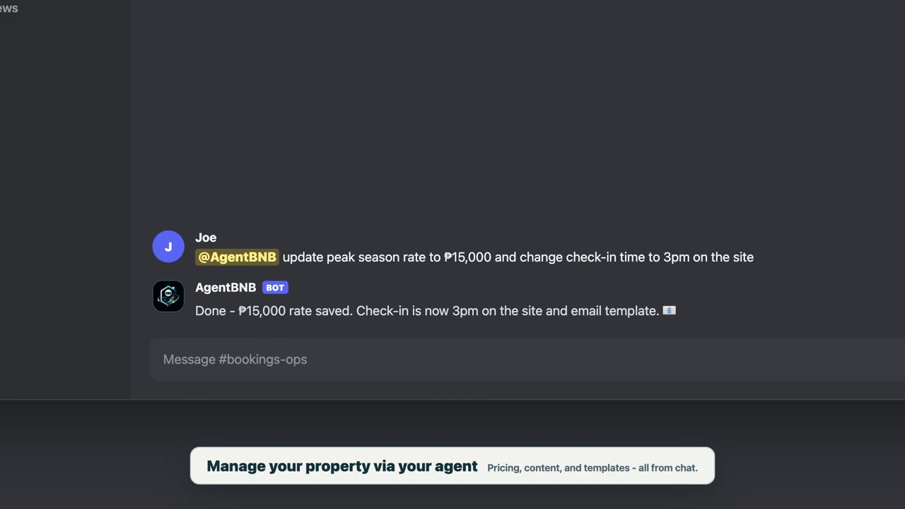

# AgentBNB

### Agent BNB is white-label hospitality operations stack for running Airbnb-like properties with an AI agent.

[Bootstrap](./BOOTSTRAP.md) | [Stack Pack](./stack/) | [Reference Implementation](./docs/reference-implementation.md) | [Data Contracts](./docs/data-contracts.md) | [Pricing Harness](https://github.com/joe-josue/agentbnb-pricing-harness) | [Support](#support)

  

## Why

The average independent property owner juggles inquiry responses, guest communication, staff briefings, calendar management, pricing, and listing updates across fragmented threads and spreadsheets. AgentBNB packages that work into a reusable digital stack an agent can run.

AgentBNB was open-sourced from a real setup: Balay Pansol (BalayPansol.com), a family-owned vacation pool house operated like an Airbnb-style short-stay property with a 90% if it's digital stack done by an AI agent workflow. The internal agent for that property is named Gideon; in your own setup, the agent would be your own property-specific operator using built on the frameworks of BalayPansol and Gideon.

## Features

### 1. Customized AI Agent

A specialized property agent (built from OpenClaw) designed to help run the complete digital stack of a short-stay property.

- **Guest communication:** Drafts or sends controlled guest messages via email, and Meta Apps messages.
- **Inquiry triage:** Checks requested dates, headcount, stay type, guest message, and known property constraints.
- **Booking progression:** Recommends approve, reject, or escalate while keeping the owner in the loop.
- **Staff handoff:** Maintains caretaker briefing notes from booking details and guest updates.
- **Website Development & Updates:** Codes website according to relevant updates (and virtually any need on the site)
- **[NEW] End-to-End Ads Management:** Operators end-to-end Ads on Meta Apps.

### 2. System Of Record Framework

A Markdown-first framework for filing the canonical knowledge of a property.

- **Property facts:** Amenities, features, location notes, capacity, rules, rates, and current limitations.
- **Operations records:** Guest scripts, check-in workflows, staff handoff templates, and change history.
- **Listing parity:** Keeps direct-site, Airbnb, Booking.com, and social copy aligned.
- **Agent context:** Gives the agent an inspectable source of truth instead of relying on scattered chat memory.

### 3. White-Label Site

A deployable Next.js hospitality site extracted from the Balay Pansol implementation.

- **Public site:** Single-scroll property page with inquiry flow and pricing estimate.
- **Admin dashboard:** Inquiry approval, booking management, calendar overview, and handoff notes.
- **Google Sheets backend:** Low-cost source of record for inquiries, bookings, reviews, and follow-up state.
- **Guest loop:** Confirmation email, thank-you email, review page, and review tracking.

### 4. Harnesses

Modular execution lanes that let the agent run specialized workflows without complicating core operations.

- **Market Pricing Harness:** Scans relevant competitors in a radius, weighs property amenities and constraints, and recommends pricing adjustments for owner review.

## Quick Start

Start with [`BOOTSTRAP.md`](./BOOTSTRAP.md). It is the canonical setup guide for both humans and agents.

1. **System of Record:** Copy [`stack/system-of-record-template/`](./stack/system-of-record-template/) to your property workspace.
2. **Website:** Copy [`stack/website-template/`](./stack/website-template/) and update property config, metadata, copy, and environment variables.
3. **Agent:** Initialize an OpenClaw-style workspace from [`stack/agent-workspace-template/`](./stack/agent-workspace-template/).
4. **Data contracts:** Use [`docs/data-contracts.md`](./docs/data-contracts.md) to verify inquiry, booking, recommendation, handoff, and review fields.
5. **Harness:** Connect the [Market Pricing Harness](https://github.com/joe-josue/agentbnb-pricing-harness) when you are ready for pricing recommendations.

## Stack

| Layer | Production Pattern |
| --- | --- |
| Public site and admin | Next.js 14, Tailwind CSS, Vercel |
| Source of record | Google Sheets plus Markdown property SoR |
| Email | Resend outbound email and inbound webhook handling |
| Agent | Property-specific agent workspace; the reference property uses Gideon on OpenClaw-style infrastructure |
| Owner cockpit | Admin dashboard plus owner recommendation flow |
| Staff handoff | Editable booking notes designed for copy/paste to caretakers |
| Follow-up | Thank-you email, review page, and review status stored per booking |

## Status

`replication-starter`

Core stack starter assets are present in [`stack/`](./stack/). The intended direction is to keep extracting from the working reference implementation into reusable, property-agnostic templates.

## Support

- If AgentBNB helped you, give it a star and share it with another operator.
- Interested building something similar for yourself or business, I do selected 0-1 product and implementation consulting.
- For collaboration or consulting inquiries, email `mail@joejosue.com`.

## License

MIT. See [`LICENSE`](./LICENSE).
